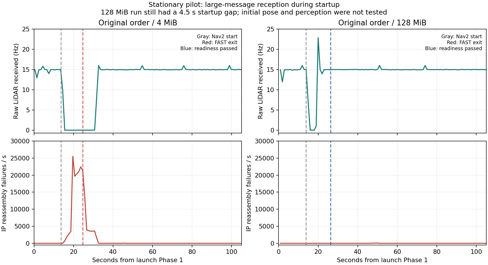

# 단계 기동 실패 — 직접 pilot 비교 결과 (2026-09-17)

이번 `IMU application buffer limit reached` 종료는 LiDAR 수신 중단에 뒤따랐다.
직접 재현과 임시 설정 비교는 **노트북의 IP 조각 재조립 큐 포화가 장시간 수신
중단을 일으키는 주요 요인**이라는 진단을 지지한다. AMCL 운동모델·FAST-LIVO2
추정 파라미터를 변경하지 않아도 이번 자동 종료는 피할 수 있었다. 다만 UDP
손실과 약 4.5초의 기동 공백이 남아 있어 네트워크 문제 전체가 해결된 것은 아니다.

## 시험 조건

- 로봇 정지, `enable_motion:=false`, NUC `forward_cmd_vel=false` 확인.
- NUC 센서·플랫폼 서비스는 그대로 유지. 초기 위치·목표·이동 명령은 보내지 않음.
- 원본 launch와 별도 임시 launch로 비교했으며 패키지 구현은 이번 시험에서 변경하지 않음.
- 관측기는 점군 원본을 저장하지 않고 메시지 개수·수신 시각·최근 odom pose와
  `/proc/net/snmp`, `/proc/net/sockstat`를 약 1초 간격으로 기록.
- A에서만 NUC에도 관측기를 추가했다. B/C에는 노트북 관측기만 있다. 따라서 모든
  외부 조건이 완전히 같은 반복 실험은 아니며, 아래 결과를 성공률로 해석하지 않는다.
- Linux `6.8.0-138-generic`, Fast DDS `2.6.10`, rmw_fastrtps_cpp `6.2.7`.

## 결과

| 시험 | 시작 조건 | 원본 LiDAR 최대 수신 간격 | 결과 |
|---|---|---:|---|
| A | 원래 launch, 재조립 한도 4MiB | 16.99초 | Nav2 기동 약 11초 뒤 FAST 보호 종료 |
| B | Nav2 먼저 기동, 수신 안정 후 FAST, 한도 4MiB | 30.67초 | 수신 회복 후에도 다시 끊겨 FAST 보호 종료 |
| C | 원래 launch, 한도만 128MiB로 임시 변경 | 4.50초 | 준비 게이트 통과, 약 110초 시험 중 FAST 자동 종료 없음 |

수신 간격은 각 관측 전체의 최대값이다. A/B 관측은 스택 종료 뒤 원본 LiDAR
수신 회복까지 포함한다. C 통계는 계획된 SIGINT 종료 전에 잘랐다.

A에서 노트북 원본 LiDAR가 끊긴 동안 NUC의 LiDAR 발행은 계속 관측됐다.
NUC 자체에도 짧은 공백은 있었고, 전체 관측의 최대 수신 간격은 0.621초였다.
노트북 IMU 최대 간격은 0.343초로, 원본 LiDAR의 약 17초 공백과 달랐다.
따라서 센서 전체 정지나 AMCL만의 장애로 이번 현상을 설명하기 어렵다.

B에서는 `FRAG` 메모리가 **4,195,704 bytes**까지 차고 IP 재조립 실패가 이어졌다.
당시 노트북 설정은 `ipfrag_high_thresh=4,194,304`, `ipfrag_time=30`이었다.
`ipfrag_high_thresh`는 IP 조각 재조립 메모리 한도이고 `ipfrag_time`은 조각 보존
시간이다. [Linux 커널 문서](https://www.kernel.org/doc/html/v6.15/networking/ip-sysctl.html#ip-fragmentation)

C에서는 사용자 승인으로 **`net.ipv4.ipfrag_high_thresh` 한 항목만** 128MiB로
180초간 변경했다. `ipfrag_time`, UDP 소켓 한도, DDS XML, AMCL·FAST 파라미터는
그대로였다. 실제 재조립 메모리 최대값은 **22,478,696 bytes (21.44MiB)**였다.

- 기동 약 26.35초 뒤 AMCL/map_server active, map·scan·odom·scan-time TF 준비 통과.
- 준비 통과 후 평가 가능한 약 81.17초 동안 원본 LiDAR 15.00Hz, FAST odom
  14.99Hz, scan 14.99Hz, adapted odom 15.00Hz. 관측된 relay 진단은 모두 `fresh`.
- 정지 중 FAST odom 위치의 원점으로부터 최대 거리는 0.0245m. 이것은 참 위치
  오차나 AMCL 정확도 측정값이 아니다.
- 약 110초 뒤 검증 실행기가 계획대로 종료했다. 이 실행의 종료를 FAST의
  `IMU application buffer limit reached` 재발로 해석하면 안 된다.

## 남은 문제와 해석 범위

1. **기동 중 4.5초 입력 공백은 여전히 실패 조건이다.** 128MiB 한도는 장시간
   재조립 정체를 줄였지만 연속 입력을 보장하지 않는다. 게이트 통과 전 지연을
   기다렸다는 사실과 운용 중 동일 공백을 견딜 수 있다는 주장은 다르다.
2. C에서도 시스템 UDP `RcvbufErrors`가 약 72.5만 증가했다. 소켓별 원인 분리는
   아직 미완료다. 노드 추가 직후 트래픽 급증과 discovery 소켓 누적 drop은
   **DDS 발견/엔드포인트 교환 트래픽이 촉발 요인일 가능성**을 지지하지만,
   패킷 캡처로 확인한 결론은 아니다.
3. 노트북 `rmem_max=212992`와 실제 DDS 수신 소켓 `rb425984`를 확인했다.
   기존 laptop XML은 receiveBufferSize 26214400을 요청한다. 요청값을 실제
   적용값으로 간주하면 안 된다. NUC의 `rmem_max`도 212992였다. 이번에는
   이 설정들을 변경하지 않았으며 버퍼 증설만으로 모든 손실이 해결된다고
   주장하지 않는다.
4. C를 종료할 때 RViz와 static costmap의 `-11`이 기록됐다. 여러 `-2`는 검증기의
   프로세스 그룹 SIGINT와 launch의 자식 종료 신호가 함께 전달된 종료 구간에
   발생했다. 정상 운용 중 최초 장애와 구분해야 하며 clean shutdown은 미해결이다.
5. C 관측기 역시 SIGINT 이후 중복 `rclpy.shutdown()` 호출로 exit 1을 반환했다.
   JSON 기록은 계획된 종료 직전까지 존재하며 위 계산에서 종료 이후 표본을 제외했다.
6. 초기 위치, 지도·scan 정합, perception 추가, 회전 중 AMCL 검증은 이번 시험
   범위 밖이다. 이번 결과로 주행 준비 완료를 선언하지 않는다.

다음 수정 대상은 네트워크 전달 경로다. 재조립 한도와 실제 소켓 설정을 정리하고,
노드 추가 시 DDS 트래픽/큰 UDP 메시지의 조각화·손실을 측정해야 한다. 기동 순서만
바꾸거나 FAST의 IMU 버퍼 한도를 키우는 처방은 이번 비교 결과로 지지되지 않는다.

## 최종 상태와 자료

임시 스크립트의 자동 복원 후 호스트에서 **ipfrag_high_thresh=4194304,
ipfrag_time=30, rmem_max=212992**를 다시 읽어 확인했다. 검증 프로세스는 남아
있지 않고 NUC 센서·플랫폼 서비스는 active다. 영구 설정·CPU/RAM 보호 정책은
변경하지 않았다. 따라서 원래 명령만 다시 실행하면 같은 실패가 재발할 수 있다.

직전 확인은 자동 승인 검토의 사용량 제한으로 실행되지 않았지만, 사용자 재개
후 같은 범위의 읽기 전용 확인을 성공적으로 완료했다.

- [집계 수치](validation/2026-09-17/staged_network_pilot/summary.json)
- [복원·종료 확인](validation/2026-09-17/staged_network_pilot/cleanup_confirmation.json)
- [원본 측정 자료](validation/2026-09-17/staged_network_pilot/)
- 최초 기록 위치: `/tmp/nav_pilot_20260917_1933/`.

B의 임시 launch는 로깅 문구를 원본대로 보존했다. B 로그의 `Phase 3: starting
Nav2`는 실제 Nav2 시작 시각이 아니며, 실제 Nav2는 Phase 1에서 시작됐다.
그 표시를 사용해 B의 네트워크 변화 시점을 잘못 해석하지 않도록 주의한다.
