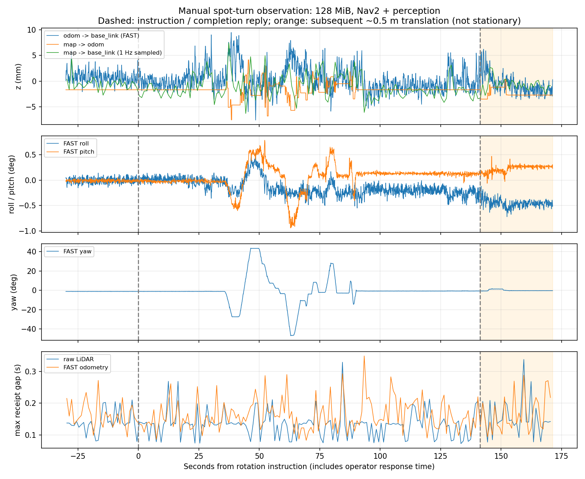

# 2026-09-18 제자리 회전 및 z축 검증

128MiB IP 재조립 한도에서 Nav2와 별도 perception을 실행하고 수동 좌우 제자리 회전을 기록했다. 사용자는 지도·scan 정합 유지를 확인했다. 이번 관측에서는 이전의 큰 TF 발산이나 FAST 자동 종료가 재현되지 않았다. 이 결과는 모든 주행 조건의 안정성이나 위치 정확도를 보증하지 않는다.

## 실행과 기록

- 실제 호스트 `net.ipv4.ipfrag_high_thresh=134217728`. 원래 값 4194304. 사용자 sudo 터미널의 임시 스크립트가 유지하며 영구 설정은 변경하지 않았다.
- `nav_bringup.launch.py` → 사용자 초기 위치 설정 및 정합 확인 → 별도 세션 `mid360_bringup perception.launch.py` 순서.
- `enable_motion=false`. `/cmd_vel_safety_bridge/get_parameters` 응답으로 `forward_cmd_vel=false` 확인. 이동은 사용자가 수동 조작했다.
- 실제 FAST 노드 이름은 `/laserMapping`이고 로그 이름은 `fast_livo`이다. 처음 `/fast_livo`로 질의한 CLI의 `Node not found`는 프로세스 종료가 아니었다. 이후 실제 노드 파라미터 저장 완료.
- AMCL `OmniMotionModel`, alpha1~5=0.2. 이번 실행에서 AMCL/FAST 파라미터나 패키지 동작 코드는 변경하지 않았다.
- 기록기는 원본 cloud/image payload를 저장하지 않았다. TF, pose, IMU 일부, 수신 간격, 커널 카운터, 검출·추적 흐름을 기록했다.
- 초기 기록기에 Humble DiagnosticStatus.level(bytes) 처리 오류가 있어 수정·재시작했다. 수동 시험 전 복구했으며 그 이전 공백을 회전 구간으로 사용하지 않았다. robot `/j100_0519/tf`와 Nav2 `/tf`는 분리했다. map/base 합성에는 `/tf`, `/tf_static`만 사용했다.

## z 측정

수치는 FAST `odom → base_link`의 최대−최소 범위이며 ±진폭이나 절대 위치 오차가 아니다.

| 구간 | 기록 시간 | z 최대−최소 | z 표준편차 |
|---|---:|---:|---:|
| 회전 안내 전 정지 | 30초 | 8.10mm | 1.06mm |
| 회전 안내~완료 응답 | 141.35초 | 17.03mm | 2.28mm |
| 사용자 재확인 후 정지 | 30초 | 6.40mm | 1.10mm |

회전 안내~완료 응답 구간에는 대기와 정지가 포함된다. 실제 회전 시간이나 연속 회전 141초로 해석하지 않는다. 이 구간의 FAST yaw 범위는 약 90.65°였으며 z는 −7.56~+9.47mm였다. 회전 완료 응답 직후 약 0.5m 이동은 FAST와 robot 기본 odometry 양쪽에서 관측했고 사용자가 실제 수동 이동이었다고 확인했다. 이를 정지 드리프트로 집계하지 않았다.

재확인된 정지 30초에서 robot 기본 odometry 이동량은 0이었다. FAST 평균 z는 −2.09mm, 첫 1/3 평균 −1.98mm, 마지막 1/3 평균 −2.34mm였다. 이 구간에 지속적인 큰 z 발산은 보이지 않는다. 다른 위치로 이동했으므로 회전 전후 평균 높이 차이를 그대로 드리프트로 해석하지 않는다.

## 어디에서 발생하는가

1. z 변화는 FAST `odom → base_link`에서 이미 발생한다. 기록된 `amcl_pose`의 z/roll/pitch는 0이다. map→odom은 FAST 3D 자세와 AMCL 보정의 관계를 반영하며 이 변환에도 z/roll/pitch 변화가 있었다. map 기준 base_link를 볼 때는 두 변환을 구분해야 한다.
2. TF 발행자 검사 구간에는 `/tf`의 odom/base_link 및 map/odom에 각각 writer 1개였고, 시간 역행·잘못된 quaternion이 없었다. `/j100_0519/tf`의 같은 이름 프레임은 별도 토픽으로 기록했다. 검사는 perception 기동 전 12초 구간이며 전체 시간에 대한 중복 발행 부재를 증명하지 않는다.
3. 구현 `base_pose_from_imu()`와 실제 파라미터를 사용해 `p_base = p_imu + R_odom_imu * t_imu_base`를 분해했다. 회전 구간 장착 위치 회전에 의한 z 성분 범위는 약 0.675mm, 역산된 IMU 원점 z 범위는 약 17.096mm였다. 관측된 17mm 변화의 대부분을 단순 장착 위치 회전만으로 설명할 수 없다. 이는 동일 추정값의 대수적 분해이며 독립 측정이나 장착 보정의 정확성 검증은 아니다.
4. 회전 중 FAST roll 범위 1.07°, pitch 범위 1.72°. 정지 재측정의 평균 roll/pitch는 회전 전과 달랐지만, 원시 IMU 평균 가속도 방향도 약 0.43° 변했다. 중간에 실제 이동이 있었으므로 실제 지면·차체 자세 변화가 포함됐을 가능성이 있다. 센서 바이어스와 추정 오차를 이번 기록만으로 분리할 수 없다.

**진단:** AMCL 파라미터에 의해 새로 생긴 z 진동보다는 FAST의 3D 높이·자세 추정 및 실제 차체 움직임에서 발생하는 변화라는 해석이 현재 증거에 더 맞는다. FAST 파라미터 오류, 장착 보정 오류, 실제 진동 중 하나로 확정하지 않는다. AMCL 추가 튜닝이나 z 강제 0 처리를 바로 적용할 근거는 부족하다.

## 남은 네트워크 문제

회전 안내~완료 응답 구간의 관측값:

- 원본 LiDAR 약 13.61Hz, FAST odometry 약 12.64Hz, IMU 약 194.28Hz.
- 최대 수신 간격: LiDAR 0.329초, FAST odometry 0.349초. 관측기 스케줄링 지연도 포함한다.
- 시스템 `ReasmFails` +2,034, UDP `RcvbufErrors` +115,714. 이 카운터를 특정 센서의 손실 수로 직접 환산할 수 없다.
- YOLO 검출 약 11.09Hz, 3D 검출·추적·궤적 약 10.13Hz. 실제 사람 검출 메시지도 확인했다.
- 초기 perception 연결 검사가 YOLO 로딩보다 먼저 타임아웃했지만, 이후 모델 초기화와 실제 검출 흐름이 확인됐다. 초기 타임아웃만으로 perception 실패로 판단하면 안 된다.

128MiB에서 큰 발산이 사라진 사용자 관찰과 이번 시험은 입력 수신 문제의 중요성을 뒷받침한다. 하지만 네트워크 오류와 약 0.35초 공백이 남아 있으므로 다음 개선 우선순위는 UDP/DDS 수신 경로의 추가 측정이다. CPU/RAM 보호 정책은 추가하지 않았다.

## 산출물과 종료 시점 상태

- `rotation_analysis.json`: 구간별 측정값. 입력 집계는 1초 health bin이므로 경계 오차가 있다. AMCL pose의 긴 발행 간격은 정지 중 갱신 조건과 구분해야 한다.
- `stationary_imu_comparison.json`, `mount_contribution.json`: 정지 비교와 장착 변환 분해.
- `samples.jsonl`, `perception_flow.jsonl`, `events.jsonl`: 원시 관측 및 사용자 확인 시점.
- `fast_livo_params.yaml`, `amcl_params.yaml`, `fast_livo_launch_params.yaml`, `tf_authority.json`: 설정과 TF 발행자 근거.
- `rotation_tf.png`: 회전 구간 그래프. 합성 map/base 값은 1Hz여서 빠른 진동의 극값을 놓칠 수 있다.

기록기 2개는 정상 종료했다. Nav2/FAST 및 별도 perception은 실행 중이며 자동 속도 전달은 비활성 상태다. 임시 128MiB 설정은 사용자 sudo 터미널에서 유지 중이다. 시험 스택을 종료하기 전에 그 터미널을 닫거나 한도를 복원하지 않는다. 종료 시 `/tmp/nav_z_20260918_1351/restore.request`를 생성하면 스크립트가 원래 값으로 복원한다.

